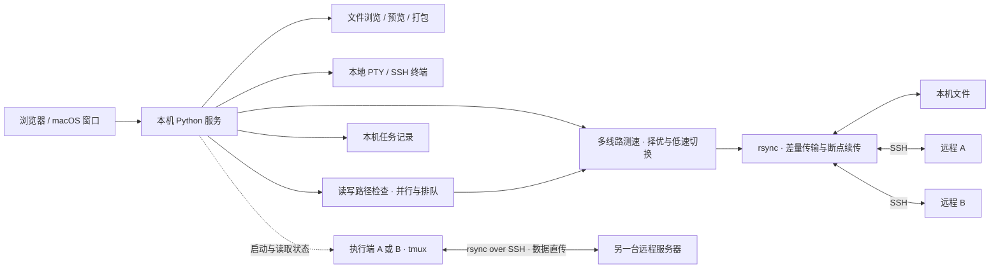

# TermiusPlus

**自动选择最快可用线路，低速时自动切换；传输中断后断点续传。**

TermiusPlus 是一个基于 rsync 的 SSH 文件与终端工作区。为同一服务器配置多个 IP、直连或跳板线路，工具会测速择优；传输持续低速时重新测速，切换到明显更快的线路，并复用已传数据继续传输。取消、断网或程序退出后，也可从记录续传。


## 亮点

| 功能 | 带来的便利 |
| --- | --- |
| **自动选择与切换更快线路** | 按上传/下载方向做两轮测速，排除登录耗时与瞬时峰值；实际速度持续下降时复测择优，网络错误时尝试备用线路 |
| **rsync 断点续传** | 切换线路、取消、断网或程序退出后，复用未完成数据继续传；再次传同一文件也会自动复用未完成任务 |
| **多任务并行与自动排队** | 不同文件可以同时传；读写路径冲突自动按提交顺序等待，完成后接着传 |
| **远程 A → B 独立会话** | 两端直接传输，不经过 Mac；本机断网、合盖后仍继续 |
| **可展开的双栏目录树** | 本地与远程自由组合，跨机器拖放传输，同一机器拖放移动，面板可调整大小 |
| **文件预览与整理** | Shift 连续多选、右键批量删除及新建、重命名、预览、快捷打包；更新保留目录展开和滚动位置 |
| **本地 + SSH 多标签终端** | 最多 8 个会话，切换文件视图时保留终端 |

后端仅用 Python 标准库，前端资源随项目提供，无需 CDN 或云端账户。

## 架构



## 开始使用

本机需要 **Python 3.9+、OpenSSH、rsync 3.x**；支持 macOS / Linux。远程文件服务需要 Python 3.6+ 与 rsync 3.x。

```bash
# macOS；系统自带的 rsync/openrsync 不满足要求
brew install rsync

git clone https://github.com/aadimao1030/TermiusPlus.git
cd TermiusPlus
python3 app.py
```

1. 打开启动时输出的**完整链接**（包含 `#` 后的访问凭证）。在该终端按 **Ctrl+C** 关闭服务。
2. 新建 SSH 连接，可填写登录密码，也可使用已有密钥或 agent；首次连接先通过系统 SSH 确认主机指纹。密码只保留在本次运行的内存中，重启后需重新输入。
3. 在两栏顶部选择位置。**双击文件夹展开/收起，三击进入**；不同机器间拖放传输，同一机器内拖到目标文件夹则移动（支持多选、同栏或双栏）。同名项目不覆盖，跨文件系统请先传输再删除源项目。传输按钮仍执行复制，记录可打开实际目标目录。
4. 点击首项后 **Shift+点击末项** 连续多选，**⌘/Ctrl+点击** 可选不相邻的项目；右键已选项目可批量删除，移入所在目录的 `.termiusplus-trash`。右键也可新建、复制路径、重命名；打包快捷键为 **⌘/Ctrl+Shift+P**。文件变化会原位更新，保留展开、选择和滚动位置。
5. 打开“终端”，点击标签旁的 **＋**，选择“本地”或已保存的远程连接。

**Mac 断联仍传：**两栏选远程 A/B，在确认框选择“远程会话”。执行端须有 tmux，并能独立通过 SSH 密钥登录另一端。此模式使用执行端的固定线路；多线路测速与切换适用于本机控制的传输。本地传输与经 Mac 中转的传输仍需要本机在线。

**macOS 窗口版：**运行 `bash launcher/build.sh` 编译安装，之后打开 `TermiusPlus.app`；退出自启动的窗口版会停止本机服务。

## 开发

```text
app.py          启动入口
termiusplus/    服务、SSH、文件操作、终端与任务管理
web/            页面、样式、浏览器脚本
static/vendor/  内置 xterm.js 与许可
launcher/       macOS 原生窗口
scripts/        远程密钥配置与旧服务兼容工具
tests/         回归测试
```

运行 `python3 -m unittest discover -s tests -v`（前端测试还需要 Node.js；tmux 测试需要本机 tmux）。更多配置与行为见 [使用说明](docs/advanced.md)。

项目为独立实现，与 Termius 无关联。MIT 许可；第三方组件遵循各自许可。
